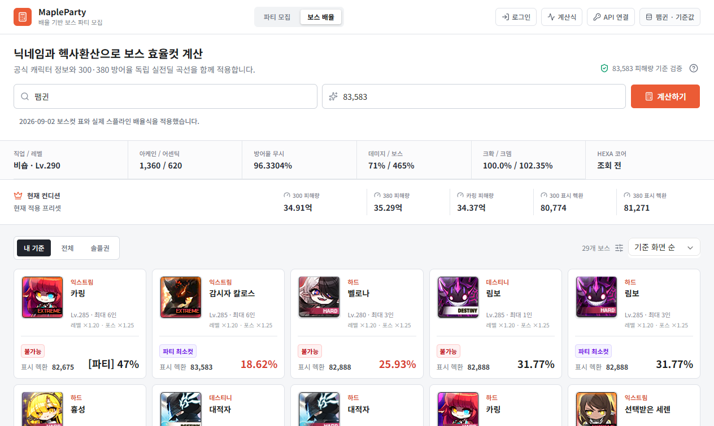
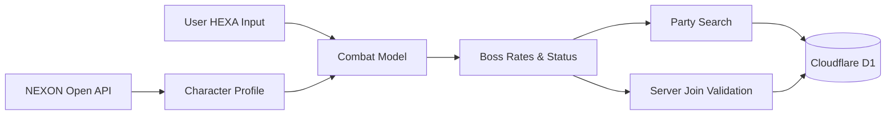
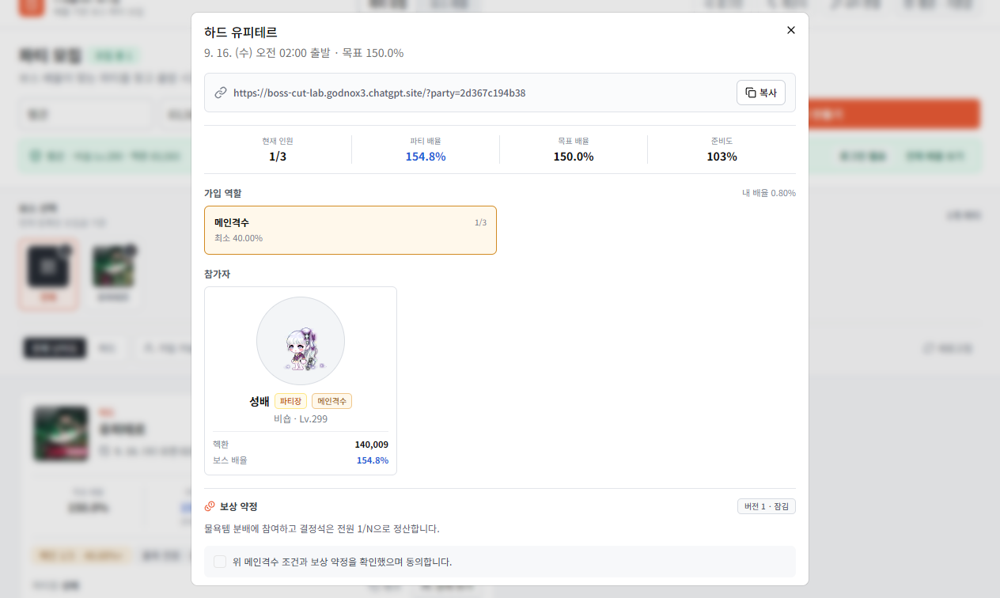
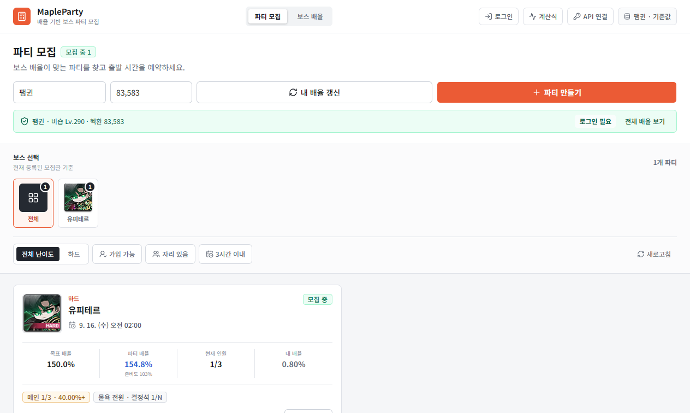

# MapleParty

**전투 데이터를 파티 모집 행동으로 연결한 게임 시스템 프로젝트**

캐릭터의 공식 전투 데이터와 사용자가 입력한 HEXA를 보스별 배율로 계산하고, 그 결과를 파티 탐색·역할 최소컷·가입 판정에 일관되게 사용합니다.

[라이브 앱](https://boss-cut-lab.godnox3.chatgpt.site) · [제출용 PDF](./output/pdf/MapleParty_Game_Programmer_Portfolio.pdf) · [상세 기술 문서](./PORTFOLIO.md)



## Project Goal

기존 보스 계산 결과는 사용자가 다시 인원별 기준과 역할 조건을 비교해야 했습니다. MapleParty는 계산과 모집을 하나의 흐름으로 연결해 다음 질문에 바로 답하도록 만들었습니다.

- 지금 도전 가능한 보스는 무엇인가?
- 내 배율로 참가할 수 있는 파티가 있는가?
- 어떤 역할과 보상 조건으로 참가하는가?
- 화면의 판단과 서버의 가입 판정이 같은 기준을 사용하는가?

## Engineering Highlights

| 영역 | 구현 |
|---|---|
| 전투 곡선 | 300%·380% 방어율별 13개 제어점을 cubic Hermite spline으로 보간 |
| 역산 | 피해량에서 표시 HEXA를 구하기 위해 같은 곡선에 40회 이진 탐색 적용 |
| 보스 판정 | 레벨·포스·방어율·보스 기준점을 조합해 31개 보스의 배율과 상태 계산 |
| 파티 도메인 | 목표 배율, 역할별 정원·최소컷, 출발 시간, 보상 약정 검증 |
| 데이터 무결성 | D1/SQLite 제약과 서버 검증으로 중복·정원 초과·조건 미달 방지 |
| 파생값 버전 | 저장 배율에 계산 버전을 기록하고 구버전 값은 합산에서 제외·재계산 |



## Problem Solving

### 프리셋 효과 중복 적용

입력 HEXA에는 선택한 장비·어빌리티·링크·유니온 프리셋 효과가 이미 포함됩니다. 초기 모델은 탐색한 프리셋 상승량을 최종 피해량에 다시 적용하고 있었습니다.

프리셋 모듈의 책임을 **최고 조건 탐색과 설명**으로 한정하고, 최종 곡선 피해량에는 같은 상승분을 재적용하지 않도록 계산 경계를 분리했습니다.

### 하드 유피테르 2,290.0% 표시 오류

운영 중 현재 입력 기준 `154.8%`여야 할 파티 배율이 과거 모델의 `2,290.0%`로 표시되는 문제를 추적했습니다. 원인은 DB에 저장한 `verified_rate`에 계산 모델 버전이 없어 구버전 파생값이 계속 합산된 것이었습니다.

- `verified_rate_version`을 추가했습니다.
- 현재 버전과 다른 저장값은 파티 합산에서 제외합니다.
- 활성 참가자는 서버에서 다시 계산해 최신 값으로 교체합니다.
- 수정 후 배율 `154.8%`, 준비도 `103%`로 정상화했습니다.



## Party Recruitment Flow



같은 보스 배율을 보스 카드, 가입 가능 필터, 파티 준비도, 역할 최소컷과 서버 가입 판정에서 공통으로 사용합니다. 사용자는 계산값을 기억해 옮겨 적지 않고 자신의 조건에 맞는 모집을 찾을 수 있습니다.

가입 요청은 서버에서 다음 순서로 처리합니다.

1. 세션과 모집 상태 확인
2. NEXON API 공식 프로필 재조회
3. 사용자 HEXA의 형식과 범위 검사
4. 보스 배율 서버 재계산
5. 역할 최소컷·정원·좌석·약정 버전 확인
6. 계산 버전과 함께 참가 정보 저장

## Validation Boundary

비숍 `팸귄`, HEXA `83,583`의 저장된 기준 스냅샷은 현재 엔진에서 다음과 같이 재현됩니다.

| 항목 | 기준값 | 현재 엔진 | 상대 차이 |
|---|---:|---:|---:|
| 방어율 300% | 34.909824억 | 34.909824억 | `< 0.000001%` |
| 방어율 380% | 35.289770억 | 35.289770억 | `< 0.000001%` |
| 카링 조건 | 34.370663억 | 34.370663억 | `< 0.000001%` |

이 표는 저장된 한 기준값의 **재현성**을 확인한 것이며 독립된 외부 정답셋에 대한 정확도 검증은 아닙니다. 여러 HEXA 구간과 타 직업의 정확도는 아직 증명하지 않았습니다.

### HEXA 신뢰 경계

- 직업·레벨·포스·공개 스탯은 NEXON API에서 조회합니다.
- HEXA는 사용자 입력이며 서버는 숫자 형식과 `0~250,000` 범위를 검사합니다.
- 서버는 공식 조회값과 입력 HEXA로 최종 배율을 다시 계산합니다.
- 입력 HEXA의 실제값과 입력자의 캐릭터 소유권까지는 증명하지 않습니다.

따라서 참가자 상태는 `검증된 캐릭터`가 아니라 **서버 재계산 완료**라는 범위로 표현합니다.

## Tech Stack

- TypeScript, React 19, Vinext, Tailwind CSS
- Cloudflare Workers, D1/SQLite
- NEXON Open API
- ReportLab, Playwright

## Code Guide

| 파일 | 역할 |
|---|---|
| [`lib/model.ts`](./lib/model.ts) | 전투 곡선, 역산, 레벨·포스 보정, 보스 상태 판정 |
| [`lib/presets.ts`](./lib/presets.ts) | 장비·어빌리티·하이퍼·링크·유니온 프리셋 비교 |
| [`lib/server/party-service.ts`](./lib/server/party-service.ts) | 파티 생성·가입·탈퇴와 서버 판정 |
| [`lib/server/party-repository.ts`](./lib/server/party-repository.ts) | 배율 버전 저장과 구버전 합산 제외 |
| [`db/schema.ts`](./db/schema.ts) | D1 테이블, 제약 조건과 인덱스 |
| [`PORTFOLIO.md`](./PORTFOLIO.md) | 구현 배경과 검증 범위 상세 문서 |

## Local Development

Node.js `22.13.0` 이상과 NEXON Open API 키가 필요합니다.

```bash
npm ci
cp .env.example .env.local
npm run dev
```

```env
NEXON_API_KEY=your_api_key
```

프로덕션 빌드는 `npm run build`로 확인할 수 있습니다.

## Disclaimer

MapleParty는 개인 포트폴리오 목적으로 제작한 비공식 팬 프로젝트이며 NEXON 또는 메이플스토리의 공식 서비스가 아닙니다.
